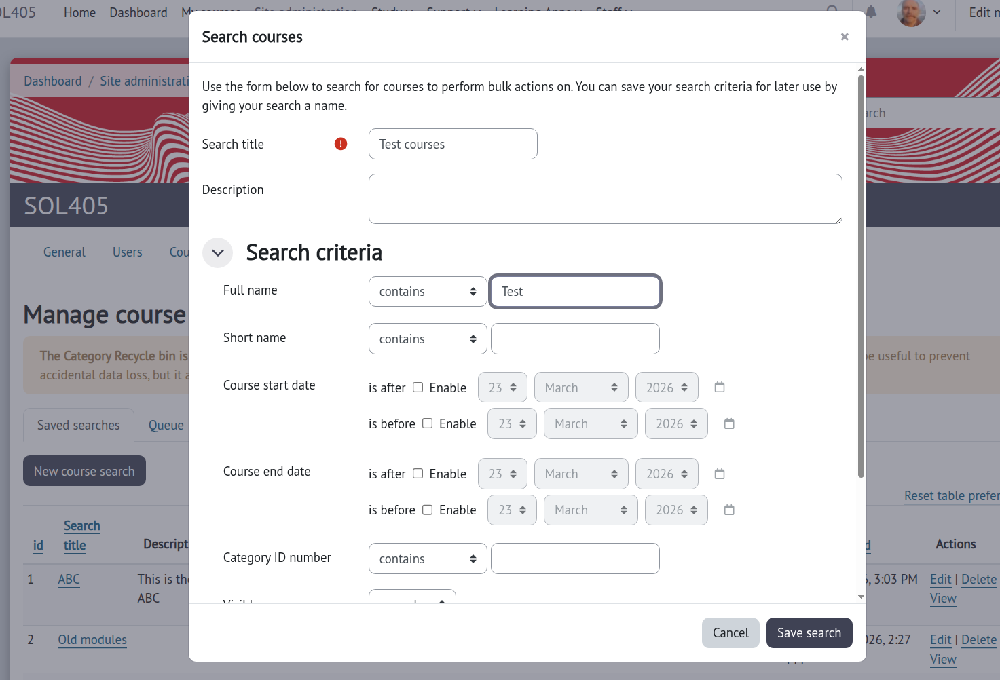
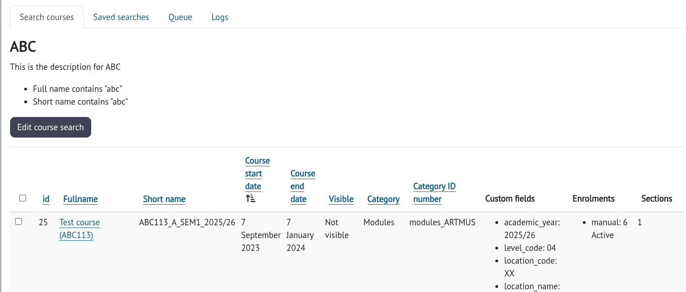
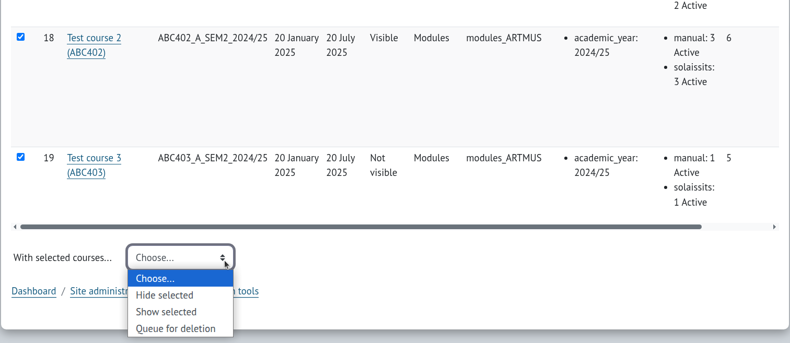
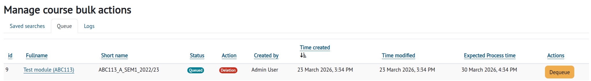
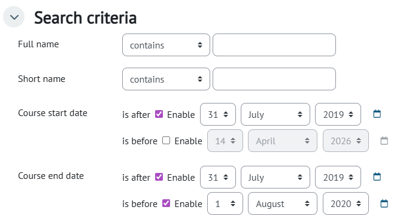
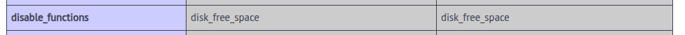
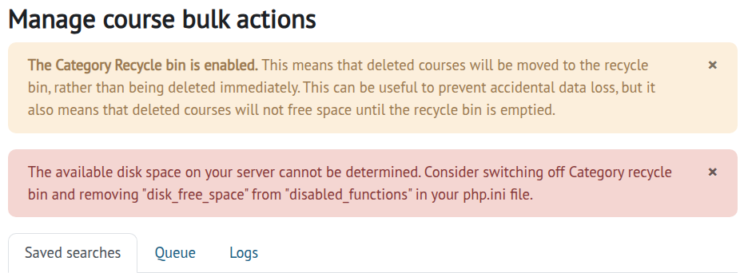
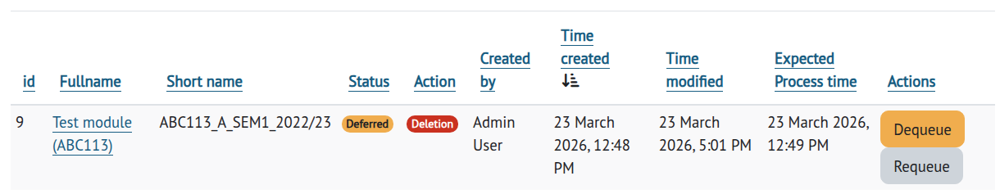
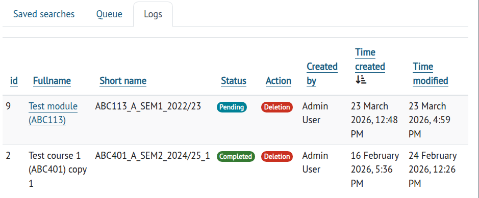
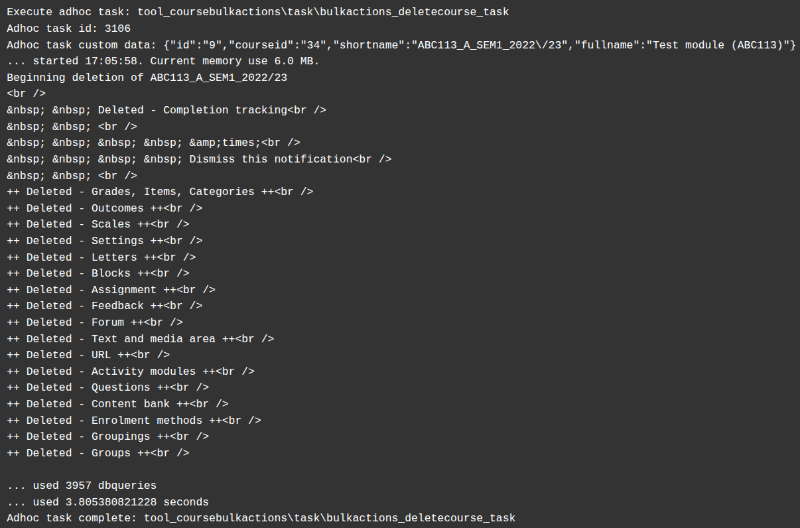

# Course bulk actions

This plugin allows you to do bulk actions on courses based on your own searches.

Course searches are saved for later use. You can edit it on the search results table.

When you see your search results you can select the ones you want to do an operation on.

Note: To help identify candidate courses for deletion, Course enrolment, and contents summaries are included.

Show/Hide will work instantly on your choices.

Deleting courses works a little differently. Because deleting courses can take a little while and can be resource hungry,
the courses you select for deletion are "queued" for a "grace period". This grace period helps to prevent accidental deletion.
By default this is 7 days.

Whilst a course is waiting for the grace period to end, you can "Dequeue" it if you realise that you don't want it deleted.

For auditing purposes a log is retained of the deletions that have occurred.

## Searching tips

### Date ranges

It's common for Courses not to have an end date. In the database this is stored as a zero.

If you want to search for course between two dates, if you set:

- "Course start date" to "is after 31 July 2019" and
- "Course end date" to "is before 1 August 2020"

this will include courses that have no end date but started *any* time after 31 July 2019 (e.g. 2024).

In order to limit just to the date range, also set:

- "Course end date" to "is after 31 July 2019"

## Can I recover a deleted course?

This depends on whether you have enabled the Category recycle bin. Site administration -> Plugins -> Admin tools -> Recycle bin.

If the Category recycle bin is enabled, then a back up of your course will be made and retained for the time specified.

If the Category recycle bin is not enabled, then no back up is made, and your course is immediately deleted.

To recover a deleted course go to the course category the course was deleted from and select the course to restore.

## Disk space

If you have enabled the Category recycle bin, be aware that this will impact your moodledata disk space. If you are doing lots of
deletes and/or keeping the deleted courses for a long time, this will increase the amount of disk space you will need.

Of course, the amount of space required is dependent on your default back up settings and the size of the course.

Best to start slow and see how that goes.

### Experimental

To help prevent running out disk space, you can specify at what threshold of remaining disk-space should delete tasks not run.

This relies on the php function `disk_free_space` being available. With some server providers this is switched off by default. Check
your "PHP info" page for `disable_functions`, if `disk_free_space` is listed, this feature will not work.

You will see the following message on your Manage course bulk actions page:

Update your `php.ini` file to remove `disk_free_space` from `disable_functions`.

If you cannot turn on the `disk_free_space` function, the only way to delete courses will be to switch off the Category recycle bin,
this will of course mean that no backups will be made.

If the task determines there is not enough space to run, the status of the queued item will be set to "Deferred".
Deferred delete tasks will remain deferred until you "Requeue" it.

## Course bulk actions cron task

This is a scheduled task that runs out of hours (every 15 minutes between 2000 and 0400). The task looks for queued items that have
passed the Grace period and can be deleted. The task then spins out an adhoc task for each course (Delete course task).

The Delete course task will run whenever Moodle is ready to run it.

## Logs

The Logs tab will show the status of any course after being Queued.

- Pending: The Adhoc task is waiting to be processed
- Processing: The Adhoc tasks is currently underway
- Completed: The course has been successfully deleted
- Deferred: Because of disk space issues, and Category recycle bin, the course could not be deleted
- Failed: For whatever reason the course has not been deleted (though some parts may have been deleted/removed e.g. enrolments).

## Failed deletion

In the case of failed deletion check out Moodle's task logs. All the output from the deletion is stored in those logs.

`Site administration -> Server -> Tasks -> Task logs` then filter on "Delete course task (tool_coursebulkactions)"

If there's a failure, no reattempt will be made to rerun the task. You should investigate the reason for the failure and rerun the
deletion. Perhaps manually run the deletion.
